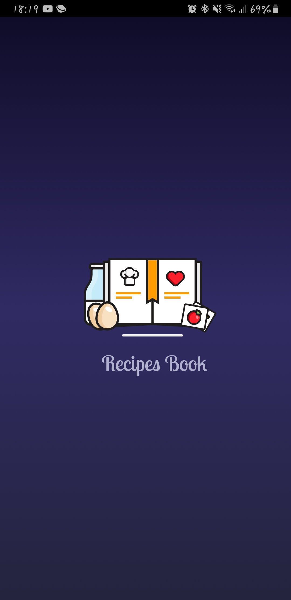
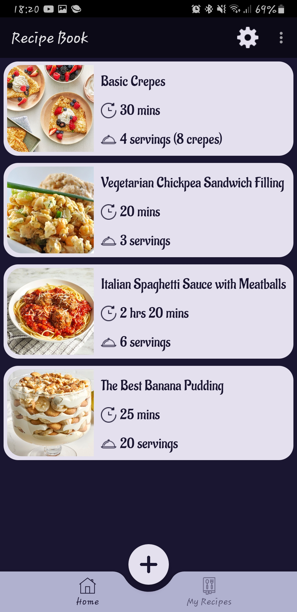
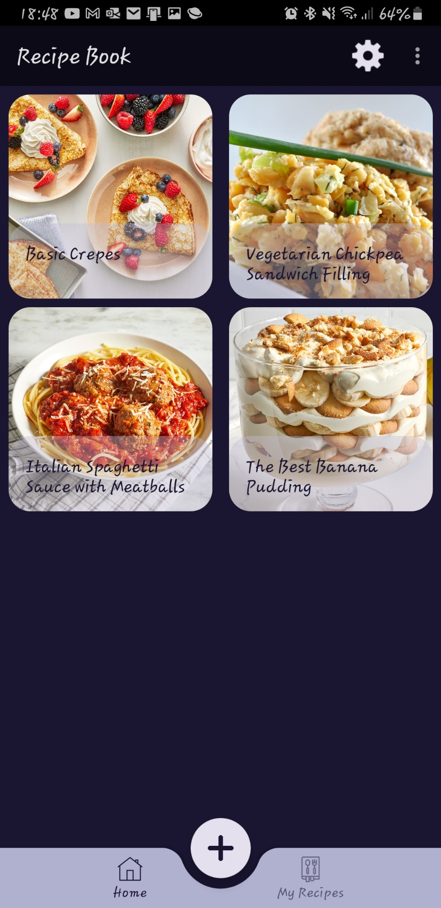
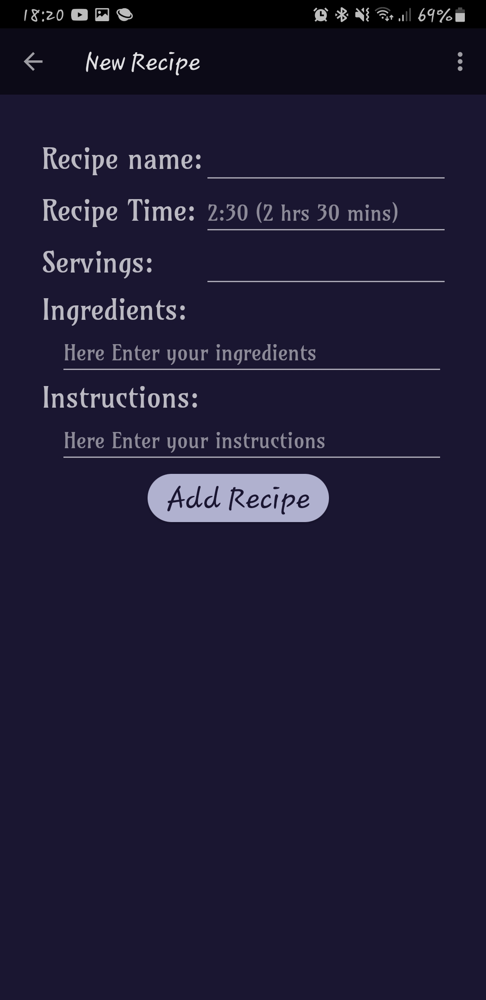
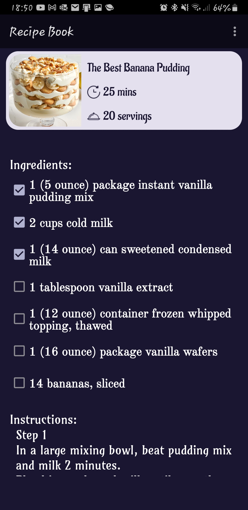
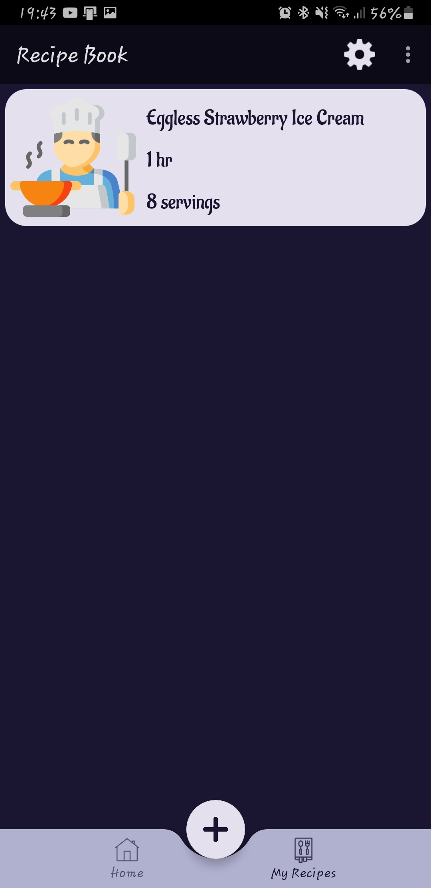
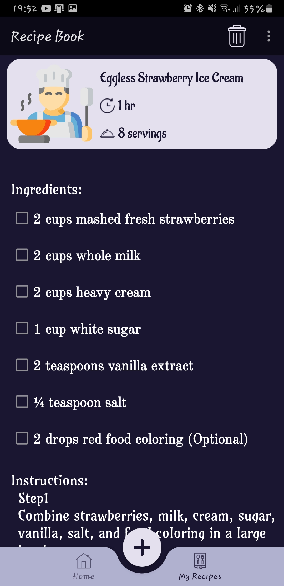
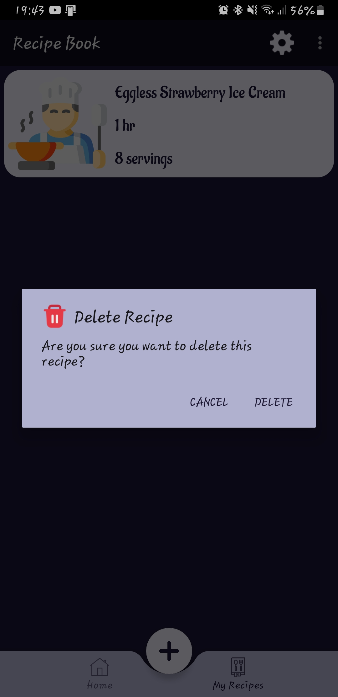

# Recipe Book
An android Mobile application
A recipes book mobile app where the user can view the in app recipes and add his own recipes.
Each recipe includes the following information: total cook time, number of servings, ingredients with a checkbox (check it if he has it), and step-by-step instructions.
There are two sections in the app: One is for the recipes that we provide, and another for the recipes that the user add, he can delete them and add as much as he wants.
In addition, the app can detect if a received message is a recipe and add it to the user's recipes without opening the app by using the broadcasting feature.
# Splash Screen

# Main Page
The recipes can be viewed in two ways: as a list or a grid.

# Add new recipe
The user can add a new recipe by clicking the "+" button on the main page and then filling in the details of the recipe.
(Note: when he clicks "Add Recipe," the input is checked to see if it's valid. Also, it's not necessary to input the time or the number of servings.

# Recipe Details
This is the recipe details page where are the ingredients and the instructions for a recipe
The user can check the ingridiant that he has

# User Recipes
View the user recipes by navigating to "My Recipes" in the navigation bar

# Delete Recipe
The user can delete his own recipe by long click on it or click on the delete icon in to bar 
in both situations a delete dialog pops-up

